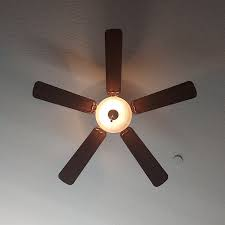

---

# Tailwind Fan Project

A simple and interactive fan animation built with **Tailwind CSS** and **HTML**. This project demonstrates how to use Tailwind's utility-first classes and a bit of custom CSS to create a spinning fan animation with a toggle button.



## Features

- Spinning fan animation with Tailwind CSS.
- Toggle button to turn the animation on/off.
- Clean, responsive design with minimal code.

## Demo

Check out the live demo (https://github.com/yashesh-akbari/Tailwind_Fan_project/blob/main/fan_tailwind_projects)

## Technologies Used

- **Tailwind CSS**: Utility-first CSS framework for creating fast and responsive UIs.
- **HTML**: Markup for structuring the content and elements.
- **JavaScript**: For toggling the fan animation on and off.

## Installation

Follow these steps to run this project on your local machine.

### 1. Clone the Repository

```bash
git clone https://github.com/yashesh-akbari/Tailwind_Fan_project.git
```

### 2. Install Dependencies

Install **Tailwind CSS** using npm. Make sure you have **Node.js** and **npm** installed.

```bash
npm install tailwindcss @tailwindcss/cli
```

### 3. Build Tailwind CSS

Run the following command to start the Tailwind CLI build process, which watches for changes in your files and generates the necessary CSS.

```bash
npx @tailwindcss/cli -i ./src/input.css -o ./src/output.css --watch
```

### 4. Link the Output CSS in Your HTML

In your `index.html`, make sure you have the following link to your compiled `output.css` file:

```html
<link href="./src/output.css" rel="stylesheet">
```

### 5. Open `index.html`

Open `index.html` in your browser to see the spinning fan animation in action.

## How It Works

- The **fan** is animated using Tailwind CSS and custom keyframes.
- The **toggle button** allows you to start or stop the animation.
- The fan image (`fan1.jpeg`) is centered and styled with Tailwind’s utility classes.

### HTML Structure

```html
<div id="spin" class="...">
  
</div>
```

### JavaScript Functionality

```javascript
function click() {
  var spinElement = document.getElementById("spin");

  // Toggle the animation class
  if (spinElement.classList.contains("animate-spin")) {
    spinElement.classList.remove("animate-spin");
  } else {
    spinElement.classList.add("animate-spin");
  }
}
```

## Contributing

Contributions are welcome! Feel free to fork this project, submit issues, and open pull requests.

### Steps to Contribute:

1. Fork the repository.
2. Create a new branch.
3. Make your changes.
4. Push to your fork.
5. Create a pull request with a detailed description of your changes.

## License

This project is licensed under the MIT License – see the [LICENSE](LICENSE) file for details.

---
